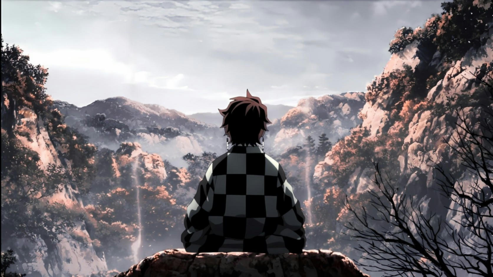
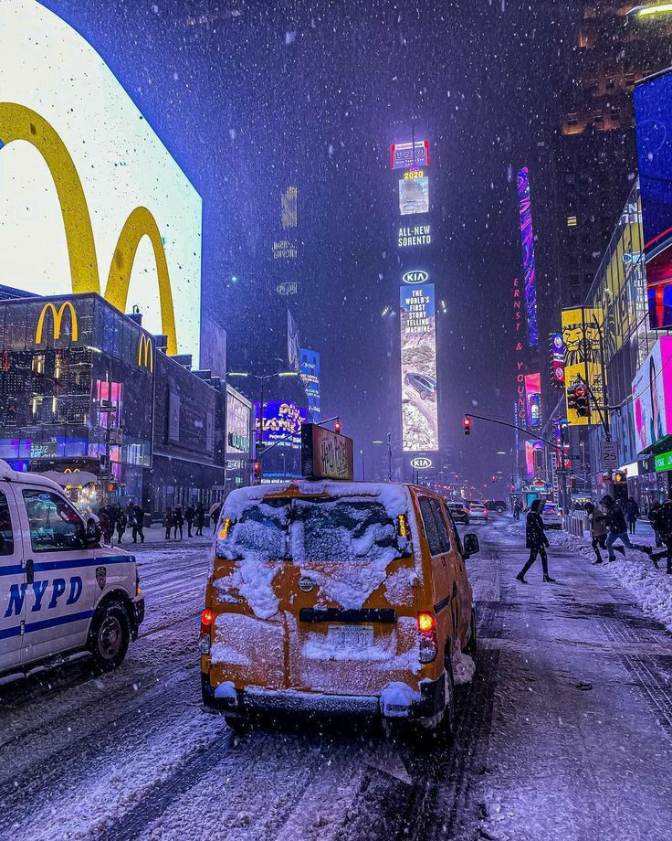
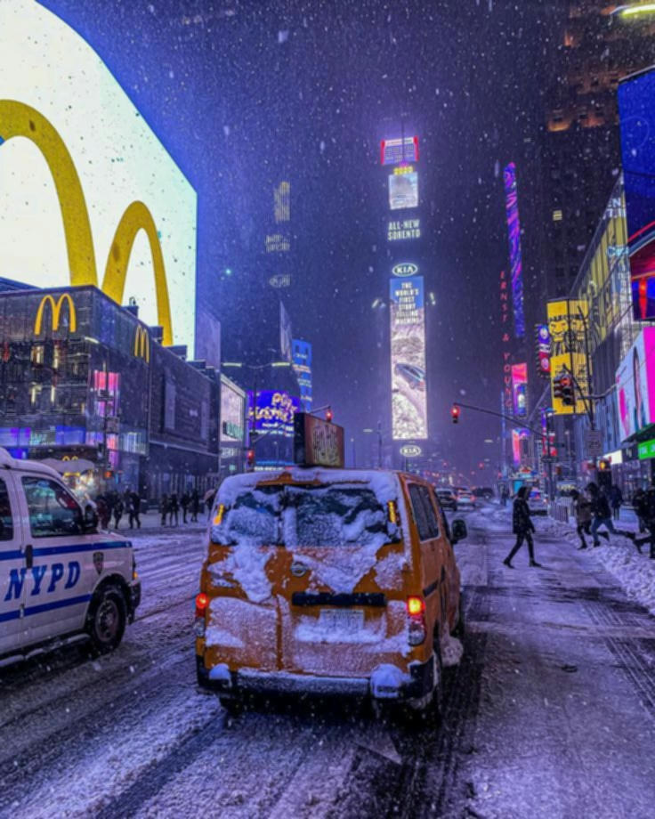

# Image Filter Project

This project implements a Box Blur (also known as Mean Filter) on an image using the Rust programming language.

## Project Description

The goal of this project is to apply a rectangular filter to an image. The filter creates a rectangle around the pixel being processed with sides `(2r + 1) * (2k + 1)`, where `r` is the radius horizontally and `k` is the radius vertically. The coefficient for each pixel equals `1 / ((2r+1)*(2k+1))`.

## Running the Application

To run this application, you need to have an image file named `original.jpg` in the root directory of the project. This image will be used as the input for the filter.

Here are the steps to run the application:

1. Place your image file in the root directory of the project and rename it to `original.jpg`.

2. Open a terminal window and navigate to the project directory.

3. Run the following command to start the application:

```bash
cargo run
```

## Examples

Here are a couple of examples showing the effect of the Box Blur filter:

### Example 1

**Input Image**:


**Output Image**:



### Example 2

**Input Image**:



**Output Image**:


